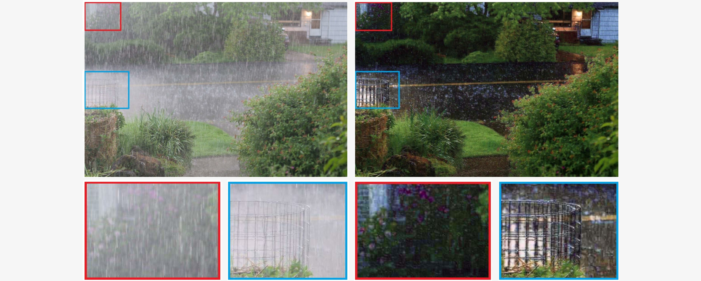
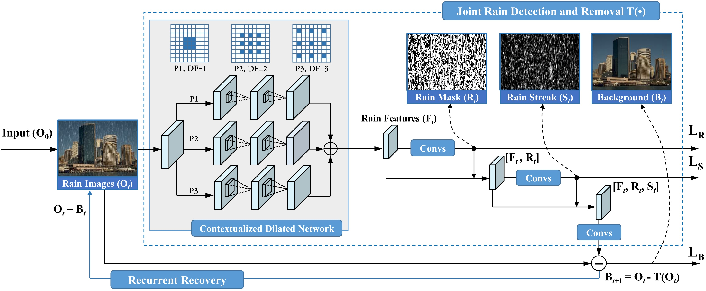

Joint Rain Detection and Removal from a Single Image

Wenhan Yang Robby T. Tan Jiashi Feng Jiaying Liu Zongming Guo Shuicheng Yan

CVPR, June 2017.
__________________________

Figure 1. An example result of our proposed rain removal method that removes heavy rain streaks and enhances the visibility significantly. Top: The raw image with rain streaks (left) and the output image of our method (right). Bottom: closer looks at specific regions (blue and red) for more details.

# 0 Abstract
In this paper, we address a rain removal problem from a single image, even in the presence of heavy rain and rain streak accumulation. Our core ideas lie in the new rain image models and a novel deep learning architecture. We first modify an existing model comprising a rain streak layer and a background layer, by adding a binary map that locates rain streak regions. Second, we create a new model consisting of a component representing rain streak accumulation (where individual streaks cannot be seen, and thus visually similar to mist or fog), and another component representing various shapes and directions of overlapping rain streaks, which usually happen in heavy rain. Based on the first model, we develop a multi-task deep learning architecture that learns the binary rain streak map, the appearance of rain streaks, and the clean background, which is our ultimate output. The additional binary map is critically beneficial, since its loss function can provide additional strong information to the network. To handle rain streak accumulation (again, a phenomenon visually similar to mist or fog) and various shapes and directions of overlapping rain streaks, we propose a recurrent rain detection and removal network that removes rain streaks and clears up the rain accumulation iteratively and progressively. In each recurrence of our method, a new contextualized dilated network is developed to exploit regional contextual information and outputs better representation for rain detection. The evaluation on real images, particularly on heavy rain, shows the effectiveness of our novel models and architecture, outperforming the state-of-the-art methods significantly. Our codes and data sets will be publicly available.

Figure. 2. The architecture of our proposed recurrent rain detection and removal. Each recurrence is a multi-task network to perform a joint rain detection and removal (in the blue dash box). In such a network, a contextualized dilated network (in the gray region) extracts rain features Ft from the input rain image Ot. Then, Rt, St and Bt are predicted to perform joint rain detection, estimation and removal. The contextualized dilated network has two features: 1) it takes a recurrent structure, which refines the extracted features progressively; 2) for each recurrence, the output features are aggregated from three convolution paths (P1, P2 and P3) with different dilated factors (DF) and receptive fields.

# 1 Results

			
			
			
 

# 2 Download
* Paper: [arXiv](https://arxiv.org/abs/1609.07769) [CVPR](http://openaccess.thecvf.com/content_cvpr_2017/papers/Yang_Deep_Joint_Rain_CVPR_2017_paper.pdf)
* Codes: [Download](http://www.icst.pku.edu.cn/struct/att/demo_JORDER_release.zip) [Download(Baidu Cloud)](https://pan.baidu.com/s/1hsgseck)
* Testing Data: Rain100H Rain100L Practical Rain100H(Baidu Cloud) Rain100L(Baidu Cloud) Practical(Baidu Cloud)
* Training Data: Train100H Train100L Train100H(Baidu Cloud) Train100L(Baidu Cloud)
* Results: Rain100L Rain100H Practical Rain100L(Baidu Cloud) Rain100H(Baidu Cloud) Practical(Baidu Cloud)

# 3 Citation
@article{Yang2017RainRemoval,
  title={Joint Rain Detection and Removal from a Single Image},
  author={Wenhan Yang, Robby T. Tan, Jiashi Feng, Jiaying Liu, Zongming Guo, and Shuicheng Yan},
  journal={IEEE Conference on Computer Vision and Pattern Recognition },
  year={2017},
}
			

# 4 Reference
[1] Y. Li, R. T. Tan, X. Guo, J. Lu, and M. S. Brown.  Rain streak removal using layer priors. In Proc. IEEE  Int’l Conf. Computer 
      Vision and Pattern Recognition,  pages 2736–2744, 2016. 

[2] Y. Luo, Y. Xu, and H. Ji. Removing rain from a single  image via discriminative sparse coding. In Proc. IEEE  Int’l Conf. Computer
	Vision, pages 3397–3405, 2015

 